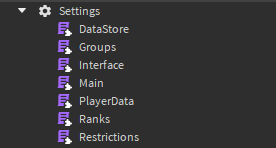
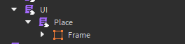

# Addon Parameters
:::warning
This page is under construction.
:::

:::tip
See [Config Parameters](/docs/Addons#config-parameters) first.
:::

- `Object: Type` - The object that will be accessed from the specified parameter path.

## Settings
:::warning
May conflict with other addons that use the same parameter.
:::
---
Object: `Configuration` <br/>

Replaces the current `Settings` object inside GAdmin (GAdminV2.Settings) with custom ones.



## ISettings
---
Object: `ModuleScript` <br/>

Adds custom settings that users can change in-game.
:::info
Setting name must be unique from existing ones on the server.
:::

```lua
local Settings = {}
Settings.Server = {}
Settings.Client = {}

function Settings.Server:Load(Config)
	Config:Set("TestSetting", true)
	Config:Set("TestSlider", 0.5)
	Config:Set("TestText", "Test")
end

function Settings.Client:Load(Config)
	Config:Set({
		Name = "TestSetting",
		Description = "Test setting from the addon.",
		
		Type = "Boolean",
		Default = true,
		
		Callback = function(Request, ...)
			print(Request, ...)
			return Request.Value
		end,
	})
	
	Config:Set({
		Name = "TestSlider",
		Description = "Test slider setting from the addon.",

		Type = "Slider",
		Default = {
			Default = 0.5,
			Min = 0,
			Max = 1,
			Slide = .1,
		},

		Callback = function(Request, ...)
			print(Request, ...)
			return Request.Value
		end,
	})
	
	Config:Set({
		Name = "TestText",
		Description = "Test text setting from the addon.",

		Type = "Text",
		Default = "Test",

		Callback = function(Request, ...)
			print(Request, ...)
			return Request.Value
		end,
	})
end

return Settings
```

## Commands
---
Object: `Folder` <br/>

Loads custom commands from a specified folder.

See [Command](/docs/Command)

## Ranks
---
Object: `ModuleScript` <br/>

Adds custom ranks into the server with your addon locally.

```lua
return {

	{
		Name = "TestRank!", -- Rank name.
		Rank = 2.2, -- Rank power (0-5)
		Color = Color3.new(0.662745, 0.705882, 1):ToHex(), -- Rank color.
		Players = {} -- Players that will have this rank by default.
	},
	
	
	{
		Name = "TestRank2",
		Rank = 0.2,
		Color = Color3.new(0.678431, 0.164706, 1):ToHex(),
		Players = {}
	},
	
}
```

## UI
---
Object: `Folder` <br/>

Loads your own pages into the GAdmin panel.

```lua
local UI = {}

function UI:Load(player, Builder)
	for i, Place in ipairs(script:GetChildren()) do
		Builder:LoadPlace(Place, Place.Frame)
	end
end

return UI
```

Structure:



Where:
	- `Place` is the page handler containing the page itself.
	- `Frame` is the page instance.

Place module:
```lua
--== << Services >>
local ReplicatedStorage = game:GetService("ReplicatedStorage")
local Main = ReplicatedStorage.GAdminShared
--==

local Place = {}
Place.Name = "PLACENAME" -- Unique name of the page.

-- Previous location. Set to nil if you want user to be stuck on this place forever.
Place.Previous = function(Location)
	return Location.Previous
end

Place.Page = 0 -- Will change to the current page that user is on.
Place.MaxPages = 0 -- Will change to the number of pages for this place.

-- Your own arguments. Can be anything.
Place.Arguments = {
	
}

-- Fires one time when Interface has loaded in.
function Place:Load(UI, Frame, Interface)
	
end

-- Gets called whenever direct Interface:Refresh() is called for this place or user changed the page of this place.
function Place:Set(UI, Frame, Page, Arguments, Interface)
	
end

-- Gets called whenever page needs to be reloaded.
function Place:Reload(Page, Interface)
	
end

return Place
```

Where:
	- `UI` is ScreenGui of admin panel.
	- `Frame` is frame of your place.
	- `Interface` is [GAdmin Interface](/api/Interface/).
	- `Page` is page frame of your place that user is currently on.
	- `Arguments` is arguments that gets passed on in [Interface:Refresh()](/api/Interface#Refresh).