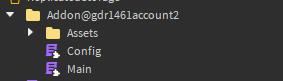

# Addons
Want to create your own addon for GAdmin? Here are some requirements you must follow:

## Universal addon structure
Every well-structured addon should follow this format:

	 <br/>

	Where: <br/>
		- The main addon folder name must follow this format: `Addon Name`@`Addon Author`.
		- Must have a `Config` with `Main` module.
		- Optional `Assets` folder for models and modules that your addon may require.

:::info
The main addon folder must include the tag `GAdmin Addon` for your addon to load properly.
:::

## Configuration
The configuration module must follow this format for the addon to work properly:

	```lua
	return {
		Enabled = true, -- Is addon enabled?
		Author = "@gdr1461account2", -- Addon author
		Version = "v1.0.0", -- Addon version
	
		Name = "Test Addon", -- Name of the addon.
		Description = "GAdmin addon.", -- Description of the addon.
		Tag = "EXAMPLE",
	
		Parameters = { -- Addon parameters
			Commands = "@this.Assets.Commands",
			Ranks = "@this.Assets.Ranks",
			UI = "@this.Assets.UI",
			ISettings = "@this.Assets.ISettings",
			--Settings = "@this.Assets.Settings",
		}
	}
	```

	Where: <br/>
		- `Tag` is an optional key that gets added as the prefix to author field.
		- `Parameters` is table of GAdmin parameters that your addon uses.
		- `Description` is detailed explanation of what your addon does.

## Config Parameters
There are many parameters you can use to enhance your addon’s functionality with the API.

	Here’s how it works:
	```lua
	Parameters = {
		KEY = PATH
	}
	```

	Where: <br/>
		- `KEY` is parameter name that you want to use.
		- `PATH` is the path to the object that the specified parameter will use. You can use any of the `Roblox services` or `@this` to reference the main addon folder as the starting point in the path.

	Find more details about addon parameters [here](/docs/AddonParameters).

## Main module
The main module lets you run code whenever the GAdmin `server` or `client` boots up.
	```lua
	local Main = {}
	Main.Server = {}
	Main.Client = {}

	function Main.Server:Start()
		print("Server booted up!")
		print(self.Assets)
		print(self.Shared)
		print(self.Server)
	end

	function Main.Client:Start()
		print("Client booted up!")
		print(self.Assets)
		print(self.Shared)
		print(self.Client)
	end

	return Main
	```

	### Server Access:
		- `Assets` folder of your addon.
		- `Shared` folder of GAdmin (GAdminV2.MainModule.Shared)
		- `Server` folder of GAdmin (GAdminV2.MainModule.Server)

	### Client Access:
		- `Assets` folder of your addon.
		- `Shared` folder of GAdmin (GAdminV2.MainModule.Shared)
		- `Client` folder of GAdmin (GAdminV2.MainModule.Client)